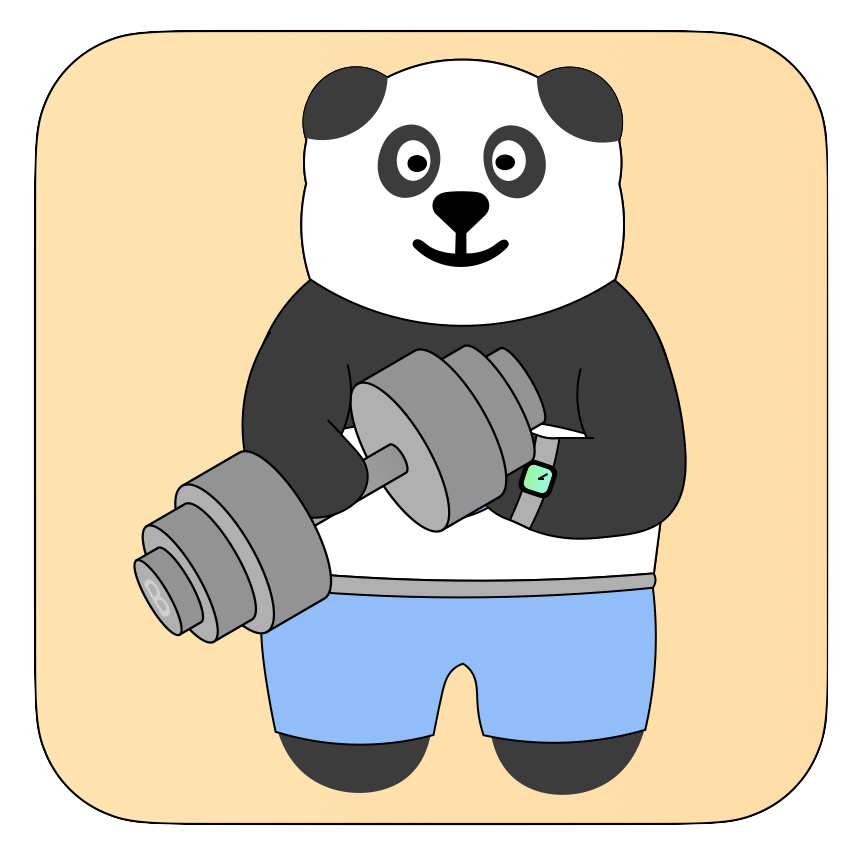
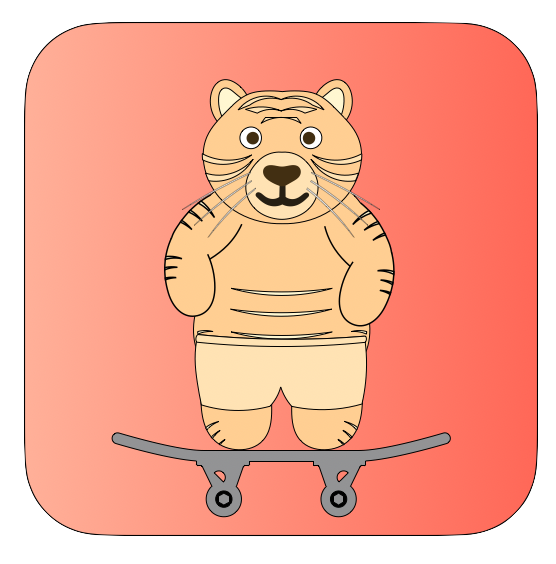

Upon its establishment, the Bear Resort has been the habitant of various creatures. Here are the ones we have adopted. 

自建立伊始，小熊樂園便是许多生灵的栖息之所。这是我们现有的一些成员。

## The Ursalinos   熊手党

# 

- Beary (小熊)
    - Beary is a Brown bear ([*Ursus arctos*](https://en.wikipedia.org/wiki/Brown_bear)), and he is the head of the Ursalinos.   小熊是一头棕熊，他也是熊手党的族长。
    - Beary is a senior technician and associate professor in the BIAS (Bear Institute of Aeronautics and Space), where he serves as a faculty of pure mathematics and astrophysics. His research interests are upon the application of algebraic topology on multiscale structure in the universe.   小熊是BIAS(熊熊航空航天局)的高级技师和副教授，也是纯数系和天体物理系的教员。他的研究主要在代数拓扑学在多尺度结构宇宙中的应用。

# 

- Little Bear (小小熊)
    - Little Bear is also a Brown bear ([*Ursus arctos*](https://en.wikipedia.org/wiki/Brown_bear)), and he is the son of Beary.   小小熊也是一头棕熊，他是小熊的儿子。
    - Little Bear is a problem kid in the Bear Resort, as he always causes troubles around. However, every time when he messes around, his innocent eyes and adorable emotions always condone him from penalties.   小小熊是小熊樂園里的问题青年，因为他处处闯祸。尽管如此，每当他搞砸了，他的无辜眼神和可爱表情总能为他脱罪。

# 

- Dr. B (胖胖博士) ([*Survey Results / 问卷结果*](https://docs.google.com/forms/d/e/1FAIpQLSdzFX4EANLZvD9Y2l2mYN_56jX23oaFzY7fUjT8BAuToITpKQ/viewanalytics?usp=form_confirm))
    - Dr. B is a Giant panda ([*Ailuropoda melanoleuca*](https://en.wikipedia.org/wiki/Giant_panda)). He owns a dual identity, serving in both the Ursalinos and the Meowstars.   胖胖博士是一头大熊猫。他拥有双重身份，同属于熊手党和喵星人。
    - Dr. B is a workout fanatic and is also a doctor (although we don’t know if he possesses a medical degree, or Doctor of Philosophy, or both). He enjoys and struggles to be the big guy. He also has a benzene reactor on his chest that he rarely takes off...   胖胖博士酷愛健身，沒人知道他是医生或是博士，又或许都是？作为一个大家伙，他既享受又烦恼。他胸部裝著一個高級苯反應堆，只是他几乎從不取下它。
 

- More Ursalinos members coming soon.

## Meowstars   喵星人

# 

- Meow-sieur Chef (神厨咪咪) ([*Survey Results / 问卷结果*](https://docs.google.com/forms/d/e/1FAIpQLSeSW_F1lZ-YPX4SVYt6Ryv5MRwZlF0ktrK1k7WABXoYVraSNQ/viewanalytics?usp=form_confirm))
    - Meow-sieur Chef is a South China Tiger ([*P. t. amoyensis*](https://en.wikipedia.org/wiki/South_China_tiger)). As the King of Beasts, he is undoubtfully the head of the Meowstars.   神厨咪咪是一头华南虎。作为百兽之王，他毋庸置疑是喵星人的族长。
    - Meow-sieur Chef is a cook, and he makes dishes for all the carnivores and bears in the Bear Resort. Absolutely marvelous control of knifes, so one should suspect what he does before becoming a chief. FYI: You'd better call him by Big Justin (which appeared to be on his ID, probably) rather than Meow-sieur (his nickname), unless you are absolutely sure that you will not become his breakfast tomorrow.   神厨咪咪是一个厨子，他为小熊樂園里的各个食肉动物和熊们准备餐点。绝佳的刀工，让人不得不怀疑他在做厨子之前干的是什么行当。小贴士：你最好叫他的真名-大哥贾斯汀，而非小名咪咪，除非你绝对知道你不会成为他明天的早餐。

# 

- Simba (辛巴)
    - Simba is a little Ginger Cat.   辛巴是一只小橘猫。
    - 

 

- More cat family members coming soon.

## Administrators   管理员

- 