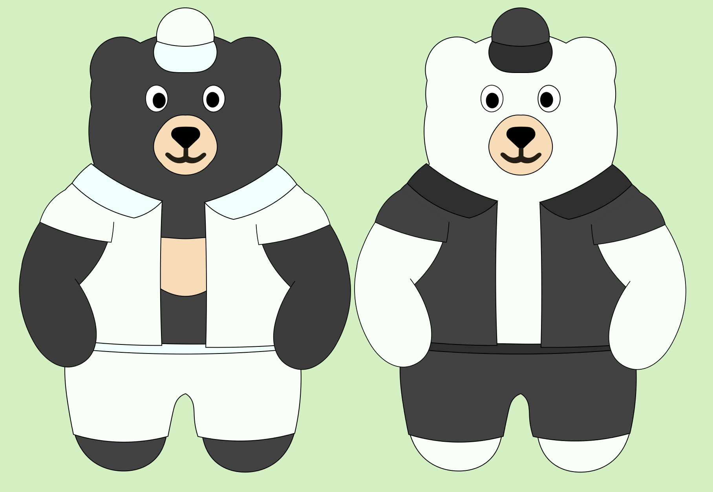

# Bear Resort Character Survey: Dual Brothers 小熊樂園角色问卷：双胞熊弟 

The Bear Resort will be welcoming two brand new bears this time. These two bears happens to be twins, although they do not look anyhow alike (the creator also doesn't know why).

小熊樂園将一次迎来两头全新小熊。这两头熊弟是一对儿双胞胎，尽管他们看起来完全不一样（作者也不晓得为什么）。 

Now, the brothers badly need some names. So it is up to you! By July 20th, we will be collecting some names for these brothers!

现在，两兄弟急需一些名字。由此，我们向大伙儿征集名字！到7月20日，我们会手机大家给兄弟们起的名字。 

# 

<form id="survey-form">
  

    

        Name of the Black Bear 狗熊的名字   
        <input type="text" name="b_name" placeholder="English..." required> <input type="text" name="b_name_ch" placeholder="中文..." required>
         
        Name of the Polar Bear 北极熊的名字   
        <input type="text" name="p_name" placeholder="English..." required> <input type="text" name="p_name_ch" placeholder="中文..." required>
         
        <textarea id="inputBox" name="feedback" placeholder="Enter your feedback here... / 输入你的意见..." style="font-size: 16px; height: 39px;"></textarea>
    

    <button type="submit" id="submitBtn">Submit 提交 </button> 
    

</form>

  
