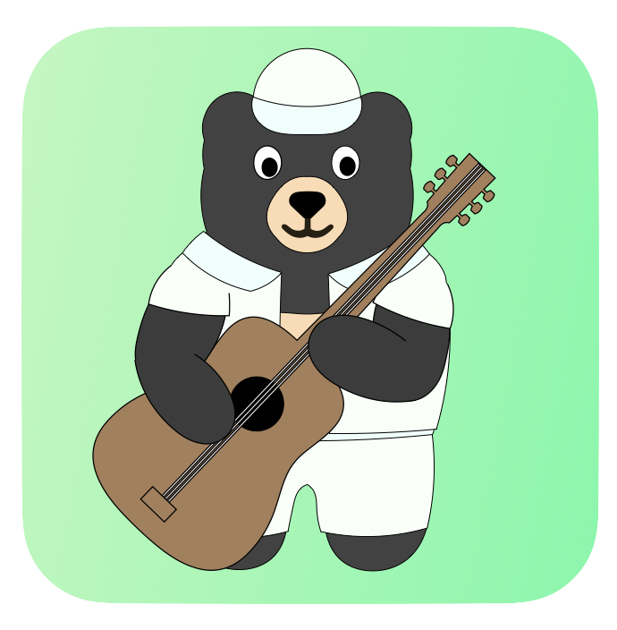
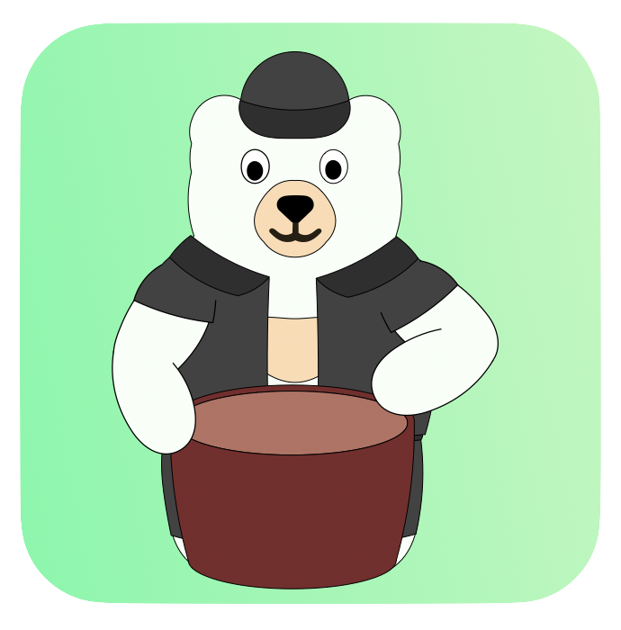

Upon its establishment, the Bear Resort has been the habitant of various creatures. Here are the ones we have adopted.

自建立伊始，小熊樂園便是许多生灵的栖息之所。这是我们现有的一些成员。

## The Ursalinos熊手党 

### Beary 小熊

###### 

- Beary is a Brown bear ([*Ursus arctos*](https://en.wikipedia.org/wiki/Brown_bear)), and he is the head of the Ursalinos.小熊是一头棕熊 ([*Ursus arctos*](https://en.wikipedia.org/wiki/Brown_bear))，他也是熊手党的族长。 
- Beary is a senior technician and associate professor in the BIAS (Bear Institute of Aeronautics and Space), where he serves as a faculty of pure mathematics and astrophysics. His research interests are upon the application of algebraic topology on multiscale structure in the universe. 小熊是BIAS(熊熊航空航天局)的高级技师和副教授，也是纯数系和天体物理系的教员。他的研究主要在代数拓扑学在多尺度结构宇宙中的应用。

### Little Bear 小小熊

###### 

- Little Bear is a Brown bear ([*Ursus arctos*](https://en.wikipedia.org/wiki/Brown_bear)) cub, and he is the son of Beary. 小小熊是一头棕熊 ([*Ursus arctos*](https://en.wikipedia.org/wiki/Brown_bear))幼崽，他是小熊的儿子。
- Little Bear is a problem kid in the Bear Resort, as he always causes troubles around. However, every time when he messes around, his innocent eyes and adorable emotions always condone him from penalties. 小小熊是小熊樂園里的问题青年，因为他处处闯祸。尽管如此，每当他搞砸了，他的无辜眼神和可爱表情总能为他脱罪。

### Dr. B 胖胖博士 ([*Survey Results**问卷结果*](https://docs.google.com/forms/d/e/1FAIpQLSdzFX4EANLZvD9Y2l2mYN_56jX23oaFzY7fUjT8BAuToITpKQ/viewanalytics?usp=form_confirm))

###### 

- Dr. B is a Giant panda ([*Ailuropoda melanoleuca*](https://en.wikipedia.org/wiki/Giant_panda)). He owns a dual identity, serving in both the Ursalinos and the Meowstars. 胖胖博士是一头大熊猫 ([*Ailuropoda melanoleuca*](https://en.wikipedia.org/wiki/Giant_panda))。他拥有双重身份，同属于熊手党和喵星人。
- Dr. B is a workout fanatic and is also a doctor (although we don’t know if he possesses a medical degree, or Doctor of Philosophy, or both). He enjoys and struggles to be the big guy. He also has a benzene reactor on his chest that he rarely takes off... 胖胖博士酷愛健身，沒人知道他是医生或是博士，又或许都是？作为一个大家伙，他既享受又烦恼。他胸部裝著一個高級苯反應堆，只是他几乎從不取下它。

### Ayin 阿殷
###### 

- Ayin is an Asian Black Bear ([*Ursus thibetanus*](https://en.wikipedia.org/wiki/Asian_black_bear)) cub. His twin brother is Ayang. 阿殷是一头亚洲黑熊 ([*Ursus thibetanus*](https://en.wikipedia.org/wiki/Asian_black_bear))幼崽. 他的双胞胎兄弟是阿阳.
- Ayin is the elder brother amongst the twins, and would always need to pickup the responsibilities in the family. Do not question him why his younger brother looks completely different, as this would really piss him up. 阿殷是双胞兄弟里的老大哥，俗话说长兄如父，阿殷已是兄弟里的顶梁柱。不要问他的弟弟和他为什么长得一点儿都不像，因为这绝对会惹到他。

### Ayang 阿阳

###### 

- Ayang is a Polar Bear ([*Ursus maritimus*](https://en.wikipedia.org/wiki/Polar_bear)) cub. His twin brother is Ayin. 阿阳是一头北极熊 ([*Ursus maritimus*](https://en.wikipedia.org/wiki/Polar_bear))幼崽. 他的双胞胎兄弟是阿殷.
- As the younger brother, Ayang is always unsatisfactory about his elder brother taking over everything. “Bro is too dominant in life,” Ayang says, as he frowns explicitly, “He is nothing like me, and I don't see why his own businesses have not exploits himself.” 作为兄弟里的老幺，阿阳对阿殷的绝对控制表达了不满。“他总想控制一切，”阿殷皱着眉说道，“他一点儿都不像我，而且我不懂为什么他自己的那些破事儿还不够他忙的。”

 

- More Ursalinos members coming soon. 更多熊手党成员即将到来。
    <!-- - [New! 全新!] [*Name Survey**命名问卷*](dual_survey.html) -->

  

## Meowstars 喵星人 

### Meow-sieur Chef 神厨咪咪 ([*Survey Results**问卷结果*](https://docs.google.com/forms/d/e/1FAIpQLSeSW_F1lZ-YPX4SVYt6Ryv5MRwZlF0ktrK1k7WABXoYVraSNQ/viewanalytics?usp=form_confirm))

###### 

- Meow-sieur Chef is a South China Tiger ([*P. t. amoyensis*](https://en.wikipedia.org/wiki/South_China_tiger)). As the King of Beasts, he is undoubtfully the head of the Meowstars. 神厨咪咪是一头华南虎。作为百兽之王，他毋庸置疑是喵星人的族长。
- Meow-sieur Chef is a cook, and he makes dishes for all the carnivores and bears in the Bear Resort. Absolutely marvelous control of knifes, so one should naturally suspect what he does before becoming a chief. FYI: You'd better call him by Big Justin (which appeared to be on his ID, probably) rather than Meow-sieur (his nickname), unless you are absolutely sure that you will not become his breakfast tomorrow. 神厨咪咪是一个厨子，他为小熊樂園里的各个食肉动物和熊们准备餐点。绝佳的刀工，让人不得不怀疑他在做厨子之前干的是什么行当。小贴士：你最好叫他的真名-大哥贾斯汀，而非小名咪咪，除非你绝对知道你不会成为他明天的早餐。

### Simba 辛巴

###### 

- Simba is a little Ginger Cat. To be honest, at this moment, we should really double check if he is really still little. 辛巴是一只小橘猫。讲真的，我们现在真的需要核实一下他真的还是小猫吗？
- Simba is the pet cat of Zhaizhai. Apart from being absolutely adorable, Simba also has his own preciousness in terms of scientific research: Simba's trajectory contains a perfectly random component and nobody knows where he would jump to at the next time step, so his movements serve as a perfect source for simulations of Brownian motions, which happens to be something that Mathy and Mousy have been researching on. 辛巴是宅宅的宠物。除了每日卖萌以外，辛巴是科研界名副其实的瑰宝：他的运动轨迹包含一个绝对随机的部分且没有任何人知道他下一刻会窜到什么地方。因此，他的动作是模拟布朗运动的绝佳资源，而这又是数数和鼠鼠长久以来的研究方向。
 

- More Meowstars members landing soon. 更多喵星人即将着陆。

 

## Administrators 管理员 

These people work on the bureaucracies inside the Bear Resort. You know, the Resort does not operate from nowhere, and it did not appear just from scratch. 这些人要处理小熊樂園里的各个杂事儿。要知道，樂園无法自动运转，也非凭空出现的。

- Mathy 数数
- Zhaizhai 宅宅
- Mousy 鼠鼠