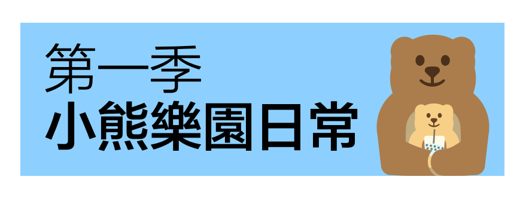
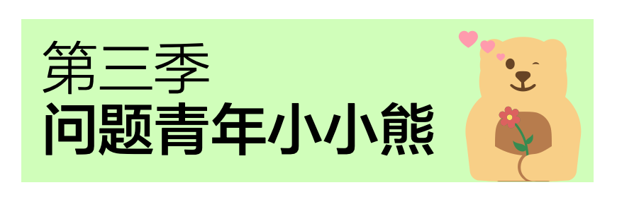
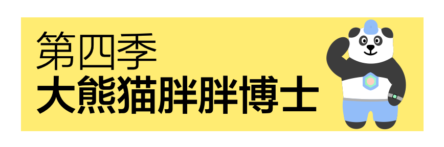

## Season 1: Daily Life in Bear Resort   第一季: 小熊樂園日常

 

Beary and little bear are two adorable bears in Bear Resort. They would enjoy the good days inside bear resort, which is the place designated for them. Join them with their cute, aminated emoji!
小熊和小小熊是小熊樂園裡兩頭可愛的小熊。他們很享受樂園裡的歡樂時光，因為這裡就是為他們精心設計的。與這套超Q的動態表情包加入他們吧！
- Author: Mathy (数数)
- Download:  [Link](https://w.url.cn/s/AR0SewL#wechat_redirect)

## Season 2: Mathy's Turntable   第二季: 數數的大轉盤
A (unproven) proposition prevailing among chinese netizens is that all emotions of human can be classified into one of five types, 典(pulling quotes), 孝(potentially excessive loyalty), 贏(win), 急(irascible), and 麻(shocked but having nothing to do). Mathy included an extra 輸(lose) to account for more aggressiveness.
在中國網路上的一個(未證明)的命題為，人類的感情可以被歸類於典、孝、贏、急和麻的一種。數數還貼心地加入了輸，讓這套表情包更富有攻擊力。
- Author: Mathy (数数)
- Download:  [Link](https://w.url.cn/s/AZh61D6#wechat_redirect)

<!-- ### D3: Beary's Expenditure of Hopkins 
### D3: 小熊勇闖霍普金斯
In Creation/創作中
- Coming soon/敬請期待 -->

## Season 3: Little Bear, the Problem Kid   第三季: 問題青年小小熊

 

Little bear is, of course, the most adorable creature in the Bear Resort. At the same time, little bear is the problem kid, regularly making troubles and got into infractions. Let's see what inappropriate stuffs little bear would do!
小小熊當之無愧是小熊樂園裡最可愛的生物。同時，小小熊也是一個熊孩子，經常在樂園裡闖禍、被警告。來看看小小熊又在樂園裡做了什麼不合時宜的事情吧！
- Author: Mathy (数数)
- Download:  [Link](https://w.url.cn/s/A9HGgcn#wechat_redirect)

<!-- ### D5: Little Bear Helps you Talk
### D5: 你的嘴替小小熊
In Creation/創作中
- Coming soon/敬請期待 -->

## Season 4: Giant Panda Dr. B   第四季: 大熊貓胖胖博士

 

Dr. B, a giant panda, is a new member joining the Bear Resort. He is a workout fanatic and is also a doctor (although we don't know if he possesses a medical degree, or Doctor of Philosophy, or both). He also has a benzene reactor on his chest that he rarely takes off...
大熊貓胖胖博士是小熊樂園的新成員。他酷愛健身，沒人知道他是醫生或是博士，又或許都是？他胸部裝著一個高級苯反應堆，只是他幾乎從不取下它。
- Author: Mathy (数数)
- Download:  [Link](https://w.url.cn/s/ABTYfiX#wechat_redirect)
