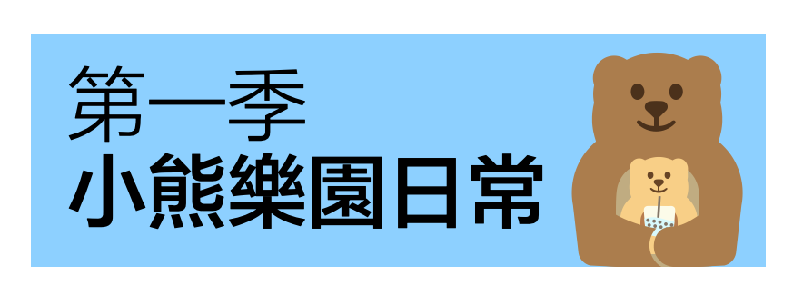

## Season 1: Daily Life in Bear Resort第一季: 小熊樂園日常

 

Beary and little bear are two adorable bears in Bear Resort. They would enjoy the good days inside bear resort, which is the place designated for them. Join them with their cute, aminated emoji!

小熊和小小熊是小熊樂園裡兩頭可愛的小熊。他們很享受樂園裡的歡樂時光，因為這裡就是為他們精心設計的。與這套超Q的動態表情包加入他們吧！

- Author: Mathy.作者：数数。
- Download下载:  [Link链接](https://w.url.cn/s/AR0SewL#wechat_redirect)

## Season 2: Mathy's Turntable第二季: 數數的大轉盤

A (unproven) proposition prevailing among chinese netizens is that all emotions of human can be classified into one of five types, classic, filial, win, irascible, and numbed. Mathy included an extra lose to account for more aggressiveness.
在中國網路上的一個(未證明)的命題為，人類的感情可以被歸類於典、孝、贏、急和麻的一種。數數還貼心地加入了輸，讓這套表情包更富有攻擊力。

- Author: Mathy.作者：数数。
- Download下载:  [Link链接](https://w.url.cn/s/AZh61D6#wechat_redirect)

## Season 3: Little Bear, the Problem Kid第三季: 問題青年小小熊

 

Little bear is, of course, the most adorable creature in the Bear Resort. At the same time, little bear is the problem kid, regularly making troubles and got into infractions. Let's see what inappropriate stuffs little bear would do!
小小熊當之無愧是小熊樂園裡最可愛的生物。同時，小小熊也是一個熊孩子，經常在樂園裡闖禍、被警告。來看看小小熊又在樂園裡做了什麼不合時宜的事情吧！

- Author: Mathy.作者：数数。
- Download下载:  [Link链接](https://w.url.cn/s/A9HGgcn#wechat_redirect)

## Season 4: Giant Panda Dr. B第四季: 大熊貓胖胖博士

 

Dr. B, a giant panda, is a workout fanatic and also a doctor. To be honest, we don't know if he possesses a medical degree, or Doctor of Philosophy, or both. We only observe that he went to the medical school and got crazy-ish after coming out of that blackbox. He has a benzene reactor on his chest that he rarely takes off, unless he is facing some worries that most middle-aged bears face...
大熊猫胖胖博士是一头健身狂魔，沒人晓得他是到底医生还是博士，又或许都是？讲真的，我们只知道他进入医学院这个黑洞后就变得疯疯癫癫的。他胸部裝著一個高级苯反应堆，只是他几乎從不取下它，除非他在面对大多数中年熊都要面对的困扰...

- Author: Mathy.作者：数数。
- Download下载:  [Link链接](https://w.url.cn/s/ABTYfiX#wechat_redirect)

## Season 5: Meow-sieur Chief, the Tiger第五季: 大老虎神厨咪咪

 

Meow-sieur Chef is the chief for all the carnivores and bears in the Bear Resort. He has absolutely marvelous control of knifes and absolute capabilities of making dishes. Many of his actions are making some clue that he must be having some unrevealed experiences prior to becoming the chief.
神厨咪咪是小熊樂園里为食肉动物和熊们准备餐点的大厨。绝佳的刀工和厨艺。他的不少行为让人不得不怀疑他在做厨子之前见不得光的行当。

- Author: Mathy.作者：数数。
- Download下载:  [Link链接](https://w.url.cn/s/A5kxBBH#wechat_redirect)

## Season 6: The Yin-Yang Twin Bears第六季: 双胞熊弟殷殷洋洋

- Coming soon.即将到来。