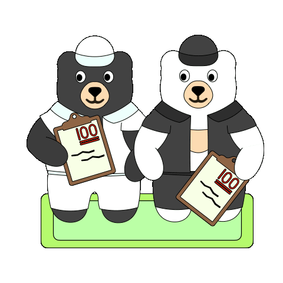

# Grade Calculator成績計算器

     
    Set up categeories, weights, add in current assingments, and set a targeted grade.輸入種類、佔比、當前成績和目標成績

    

    <label for="goal-slider">Aimed grade目標成績:</label>
    <input id="goal-slider" type="range" min="0" max="100" value="93" oninput="updateGoalValue(this.value)">
    93
  

  

  <table id="category-table">
    <thead>
      <tr>
        <th>Category種類</th>
        <th>Weights佔比 (%)</th>
        <th>Weighted Grade比例成績</th>
        <th>Actions動作</th>
      </tr>
    </thead>
    <tbody id="category-tbody">
      <!-- Categories go here -->
    </tbody>
  </table>
  

    <button id="add-category">Add a Category增加種類</button>
  

    

  

  
