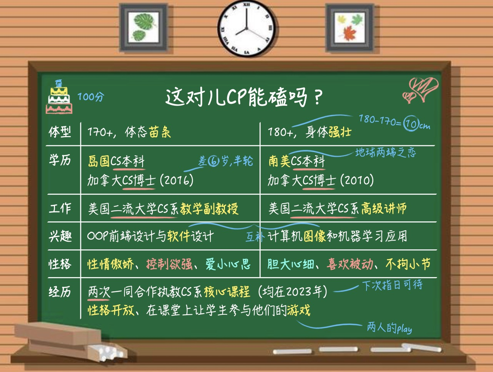

# 🐭🔢做高级讲师｜这对儿CP能磕吗？👾

灵感来源：嗑疯了的野人，投稿

👏非常荣幸，鼠鼠、数数和宅宅成为了某美国二流大学的«临时助理讲师»🎙️。在这节公开课钟，我们将为大家介绍恋爱学，通过一个虚拟案例来作为铺垫。⚠️事先声明⚠️，案例中的CP纯属虚构，如有雷同，那大概是ta们的缘分。完整盾请参考[1]

🧍首先是必不可少的体型差环节。二位身高相差~10cm，让人不禁代入身高差20cm的月刊少女里男女主的酸甜爱情！况且，虽然二者身材都类似原神里的成人体型，ta们的体重却又达成了完美的互补。有差异，有相似，还有互补。ta们在一起应该总能从对方身上学到东西吧。

🏫 学历和工作是人类必不可少的通行证！这次的案例中，来自天南地北的ta们一起在加拿大攻读博士，简直是从博士开始的青梅竹马。最终，ta们也顺利在同一所美国二流大学任教。尽管两人都没有tenure，而且还在同一个teaching赛道，但是这样的竞争关系，又何尝不是一种CP之间互相激励进步的阶梯呢？

❤️ 每个人都有自己的兴趣，而CP之间的XP更是情感之间的催化剂！ta们二人分治前后端两域，他们合作设计的软件/作业仿佛是情感的结晶一般。学生们怨声载道的时候可曾想过这或许是二人共同的xp呢？

😳 性格是人类世界里的通行证，而两人的性情可谓天作之合。不论是后者的不拘小节包容前者的傲娇，又或是前者的爱小心思体验后者的胆大心细，相信ta们能擦出不一样的火花！

💯 由此，我们给这对CP打出了100的高分！这是模范一般的情侣！也请读者自行分析这对情侣的匹配度，把你的观点分享在评论区！

1. 宇宙免责声明：本文仅表达作者个人关点，不喜勿喷，不要对号入座，无人物原型，不针对种族歧视，物种歧视，性别歧视，维度歧视，智商歧视，年龄歧视，学历歧视，声音歧视，长像歧视，体重歧视，分数歧视，速度歧视，身高歧视。支持硅基生物，人工智能等人群。如有雷同，纯数巧合
2. 鼠鼠和宅宅和数数对本文的种种谜语人进行了破译。我们应该已经很接近正确答案，不过作者说还差一点。