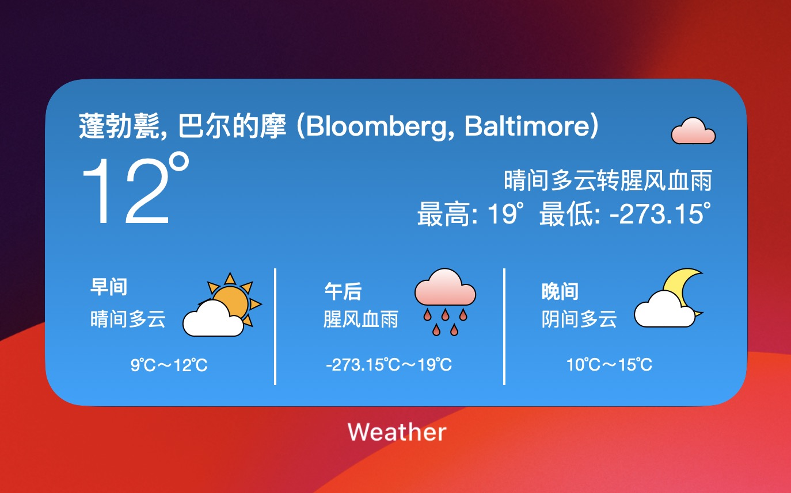

# 🐭🔢常驻嘉宾｜本周二天气预报👾

[< 返回](intro.md)

不知不觉中，半个学期悄然而逝📅。明日即为一年一度的相对论期中考试🖊️。以下是相对论神殿（霍姆伍德校区）的天气预报☁️。

根据物理系考试下雨猜想（未证明）❓，本周二，本市范围内将有阵雨🌦️。请大家备好雨具🌂，并留意天气变化👀。

届时，即使物理系的天气操纵技术没有达到预期，物理系的同学们也会用行动在蓬勃甏(Bloomberg)达成一场腥风血雨。

1. 补档注：蓬勃甏为蓬勃堡(Bloomberg)的旧译，因字形过于复杂而被弃用。