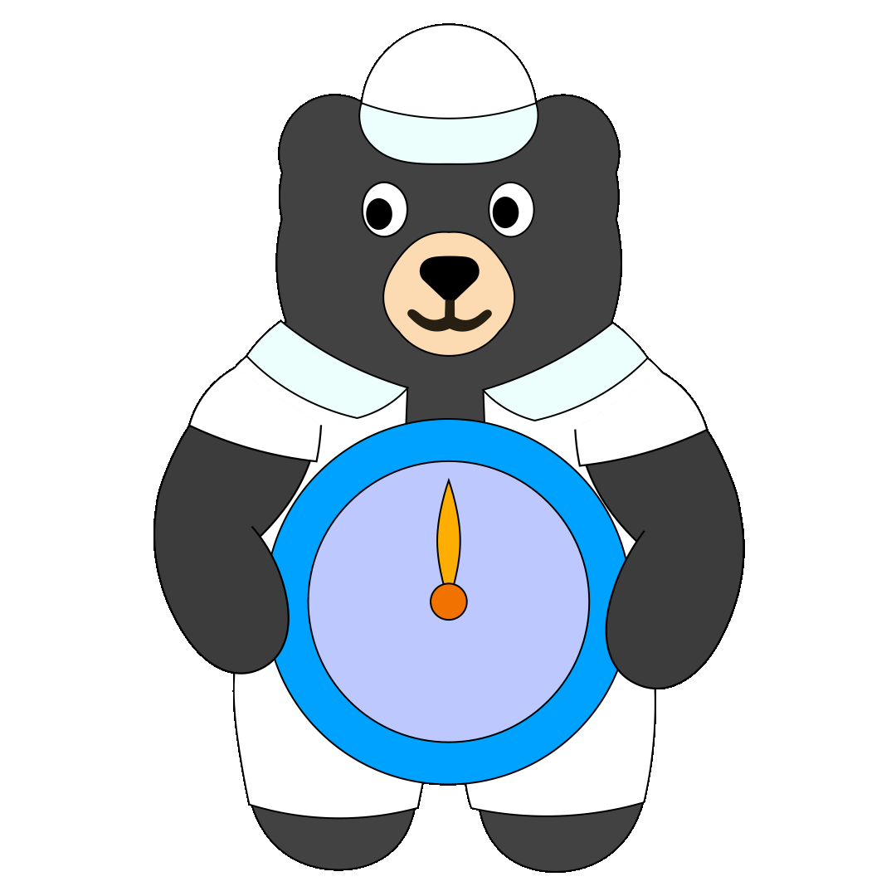

# Countdown Timer计时器

    

    

    <input type="number" id="hoursInput" placeholder="0" min="0"> Hour(s)小时 
    <input type="number" id="minutesInput" placeholder="00" min="0" max="59"> Minute(s)分 
    <input type="number" id="secondsInput" placeholder="00" min="0" max="59"> Second(s)秒  
    

        <button id="startButton">Start开始</button>
    

    <button id="pauseResumeButton">Pause暂停</button>
    <button id="stopButton">Stop停止</button>

00:00:00

    <button id="add30sButton">Add 30s加30秒</button>
    <button id="add1mButton">Add 1m加1分钟</button>
    <button id="add5mButton">Add 5m加5分钟</button>

